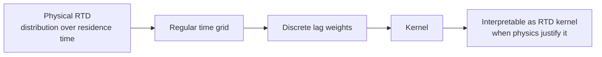
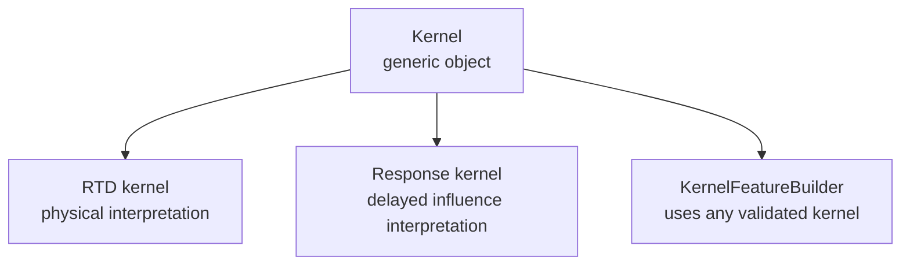

# Core Concepts

Internal changes should preserve the golden path: fit or define kernel → generate `TransformResult` → inspect features/report/registry. See `development/architecture-principles.md`.

## Residence-Time Distribution

A residence-time distribution, or RTD, describes the distribution of times that material spends inside a process unit or system before appearing at the output.

In plain terms:

```text
If material leaves the system now, how old is it?
```

Equivalently:

```text
What fraction of the current output entered 5 minutes ago?
What fraction entered 30 minutes ago?
What fraction entered 2 hours ago?
```

An RTD is not a single delay. It is a distribution over many possible residence times. Some material may pass through quickly, while some may spend much longer inside the system.

## Kernel

A kernel is the generic object in this package. It is a causal weighting over historical timesteps:

```text
lag 0 -> weight
lag 1 -> weight
...
lag K -> weight
```

In plain terms, a kernel answers:

```text
How much should each prior timestep contribute to the current value?
```

Learned kernels must satisfy:

- Non-negative weights
- Weights sum to one
- No future leakage
- Finite lag support

Those constraints matter because they keep the object interpretable. A learned kernel should behave like a distribution over lag, not like an unconstrained impulse-response fit that is difficult to explain to engineers.

Direct parametric kernel construction also returns this same constrained kernel
object. It converts supplied family parameters onto a discrete lag grid; it
does not perform parameter fitting, final prediction, or causal discovery.

## Why A Kernel Can Model An RTD

In continuous time, an RTD is often written as a distribution or density over elapsed time. In this package, the same idea is represented on a regular discrete time grid:

```text
lag step 0 -> fraction associated with the current timestep
lag step 1 -> fraction associated with one timestep ago
...
lag step K -> fraction associated with K timesteps ago
```

When the data is sampled on a regular grid, a non-negative, sum-to-one kernel is a discrete distribution over residence time. That is why a kernel can be a valid RTD model.



## RTD Kernel

An RTD kernel is a kernel used specifically as a discrete RTD model.

Typical RTD-style cases:

- Tracer in to tracer out
- Feed composition to product composition
- Inlet concentration to outlet concentration

In those settings, the kernel can be read as:

```text
What fraction of the current output is associated with each prior input time?
```

If the relationship is approximately transport or mixing dominated, then:

```text
current output
≈ weighted sum of prior inputs
```

and the kernel weights are the discrete approximation to the RTD.

## When The RTD Interpretation Is Valid

Calling a kernel an RTD kernel is reasonable when most of these are true:

- The input and target are linked by material or tracer movement
- A causal mixing or transport interpretation makes physical sense
- The learned weights are non-negative and sum to one
- The lag support is bounded and plausible for the process
- The learned kernel beats simple lag baselines
- Diagnostics do not show obvious identifiability failure

The kernel structure alone is not enough. The RTD interpretation comes from both the mathematical constraints and the process context.

## Response Kernel

A response kernel is still a kernel, but its meaning is delayed influence rather than physical residence time.

Typical response-kernel cases:

- Feed hardness to mill power
- Reagent dose to downstream recovery proxy
- Upstream instability to downstream operating response

In those settings, the kernel should be interpreted as:

```text
When do past inputs most strongly influence the current target?
```

The package supports both interpretations, but it should not claim RTD semantics when the evidence only supports a response interpretation.



## Process Signal

A process signal is any measured or derived time-series variable used as an input, target, or feature source.

Examples:

- `flowrate`
- `temperature`
- `pressure`
- `density`
- `moisture`
- `particle_size`
- `operating_mode`
- `material_class`

Signals play different roles in different steps:

- `input_col` is used to learn a kernel
- `target_col` is used to fit and validate that kernel
- source columns are used to generate features once a kernel is available

## Feature Plan

A FeaturePlan is a serialisable set of feature-generation requests that can be executed by `rtdfeatures`.

A plan may contain:

- kernel references
- source columns
- feature families
- optional weight columns
- optional provenance fields

## KernelSpec

A KernelSpec is a serialisable description of a kernel, not a fitted result. It captures kernel definition metadata so a kernel can be validated and resolved without embedding live model state.

## FeatureSpec

A FeatureSpec is a serialisable request to apply a kernel to one or more source columns with a specified feature family.

## KernelRegistry

A KernelRegistry is a named lookup for kernels and kernel specs. It supports consistent references from feature plans without owning graph topology.

## Kernel Composition

Sequential kernels can be composed by convolution to approximate total path memory.

Guardrail:

```text
rtdfeatures composes kernels.
it does not discover graph paths.
```

## ObservationSemantics

Observation semantics describe how values were observed so validation can reason about compatibility and leakage risk.

Generic classes include:

```text
instant
interval_start
interval_end
interval_midpoint
online
grab
composite
event
derived
```

## ColumnRole

Column roles provide minimal intent tags for validation and leakage checks, not for rebuilding a feature store.

Example roles:

```text
input_tag
target
lab_label
event
setpoint
controller_output
downstream_measurement
future_known
forbidden
```

## Interpretation Classes

Not all kernel-derived features should be described as RTD-like. Use interpretation classes where needed:

```text
material_memory
process_response
statistical_pattern
unknown
```

## Weighted Feature

A weighted feature applies a kernel to signal history.

Without `weight_col`:

```text
feature_t = sum_k w_k x_{t-k}
```

With `weight_col`:

```text
feature_t =
    sum_k w_k weight_{t-k} x_{t-k}
    / sum_k w_k weight_{t-k}
```

This distinction matters:

- Without `weight_col`, the feature is a lag-weighted historical summary
- With `weight_col`, the feature is a contribution-weighted historical summary

That makes `weight_col` appropriate for flow, throughput, mass, or other row-level contribution measures.

## Age Features

Age features are kernel-derived summaries such as mean lag, median lag, percentile lag, or tail mass. They describe the kernel itself rather than the source signal values.

For static kernels they are constant across rows, but `transform()` still emits them as columns on every output row so the feature table is self-contained.

## Contribution Weights

Contribution weights describe how much prior rows contributed after applying both the kernel and any `weight_col`.

Conceptually:

```text
kernel weight = contribution assigned to a lag step
contribution weight = contribution assigned to a specific historical row
```

Dense contribution matrices are useful for diagnostics, but they are not the default production representation.
