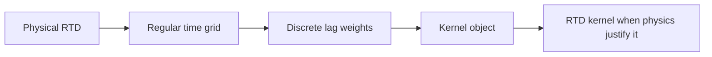

# Kernels and RTDs

## Kernel (generic object)

A kernel is a causal weighting over historical timesteps:

```
lag 0 -> weight
lag 1 -> weight
...
lag K -> weight
```

Learned kernels in `rtdfeatures` always satisfy:

- **Non-negative** weights
- **Sum-to-one** weights
- **No future leakage** (causal — only past and present influence current)
- **Finite lag support** (bounded by `max_lag`)

These constraints keep the object interpretable: a kernel behaves like a distribution over lag, not like an unconstrained impulse-response fit.

Any kernel — learned, fixed, or parametric — can be passed to `KernelFeatureBuilder` for feature generation.

## RTD (Residence Time Distribution)

An RTD describes the distribution of times that material spends inside a process unit before appearing at the output:

```
If material leaves the system now, how old is it?
```

On a regular discrete time grid, a non-negative, sum-to-one kernel is a valid discrete RTD model when the physics justify the interpretation.



## RTD kernel vs response kernel

Two interpretations of the same kernel object:

| Interpretation | Meaning | Example |
|---|---|---|
| **RTD kernel** | Material residence time | Tracer in → tracer out, feed → product concentration |
| **Response kernel** | Delayed influence | Feed hardness → mill power, dose → recovery proxy |

The package supports both. The interpretation label lives in `FeatureEvidence.interpretation`. Choose conservatively.

## When an RTD interpretation is valid

All of these should be true:

- Input and target are linked by material or tracer movement
- A causal mixing or transport interpretation makes physical sense
- Learned weights are non-negative and sum to one (always true for package kernels)
- Lag support is bounded and plausible for the process
- Learned kernel beats simple lag baselines
- Diagnostics do not show obvious identifiability failure

**The kernel structure alone is not enough.** RTD interpretation requires both mathematical constraints and process context.

## Key rule

> A learned kernel is not automatically an RTD.

Always label kernels conservatively. Use `"process_response"` or `"statistical_pattern"` in `FeatureEvidence` unless independent physical evidence supports a material-residence interpretation.

## See also

- [Interpretation boundary](interpretation-boundary.md) — detailed guidelines and examples
- [Identifiability](identifiability.md) — when to trust a learned kernel
- [Data model](data-model.md) — regular-grid assumptions and kernel representation
- [02_core_concepts.md](../02_core_concepts.md) — normative reference for concept definitions
