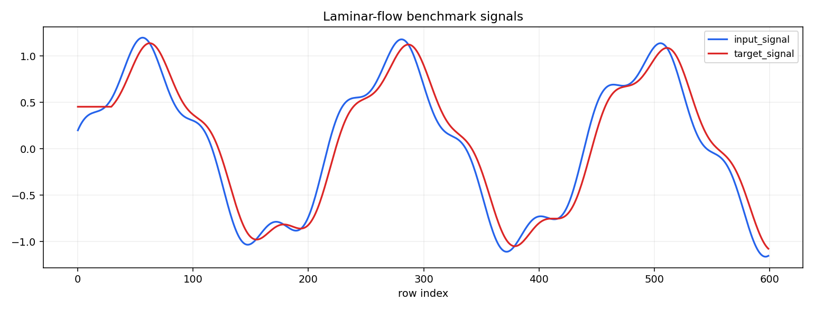
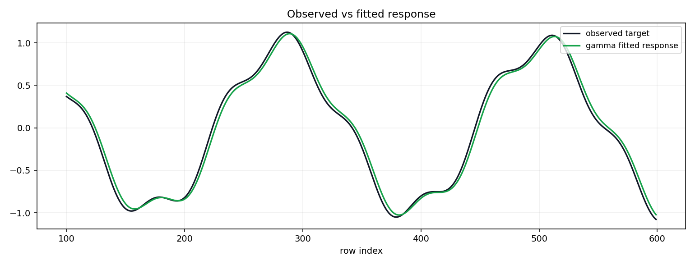
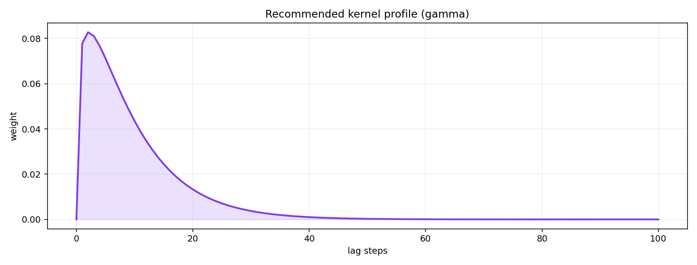

# nRTD Laminar-Flow Worked Example

Generated from `test_data/benchmarks/nrtd/hsa_000_laminar_flow_signals.parquet`.

## Introductory Time Series



## Data Load

- rows: `600`
- columns: `['time', 'input_signal', 'target_signal']`
- inferred regular-grid step: `1.000000000` seconds

## Learner Setup

Fitted with public learners only on `input_signal -> target_signal` using `time`:
`SimplexKernelLearner`, `GammaKernelLearner`, `ExponentialKernelLearner`, `FixedDelayKernelLearner`.

## Fit Diagnostics And Baselines

| learner | validation_loss | no_lag | best_single_lag | mean_lag_s | warning_codes |
|---|---:|---:|---:|---:|---|
| `simplex` | 0.001977 | 0.018239 | 0.001152 | 10.486 | BEST_SINGLE_LAG_BEATS_LEARNED |
| `gamma` | 0.001144 | 0.018239 | 0.001152 | 9.537 | none |
| `exponential` | 0.001390 | 0.018239 | 0.001152 | 9.768 | BEST_SINGLE_LAG_BEATS_LEARNED |
| `fixed_delay` | 0.001152 | 0.018239 | 0.001152 | 9.000 | none |

## Fit Quality Plots





## Recommended Kernel For Feature Generation

- `recommended_kernel`: `gamma`
- `recommendation_status`: `recommended`
- `recommendation_reason`: `lowest validation_loss among the fitted public learners`
- Fit RMSE: `0.059991`
- Fit MAE: `0.051828`
- Observed/predicted correlation: `0.9963`
- Fit evidence interpretation: correlation above 0.7 and low absolute error support a useful lag fit for feature generation.

## Generated Feature Preview

```text
shape: (8, 8)
┌────────────┬────────────┬────────────┬───────────┬───────────┬───────────┬───────────┬───────────┐
│ time       ┆ learned_nu ┆ learned_nu ┆ learned_n ┆ learned_a ┆ learned_a ┆ learned_a ┆ learned_a │
│ ---        ┆ m_input_si ┆ m_input_si ┆ um_input_ ┆ ge_mean   ┆ ge_p50    ┆ ge_p90    ┆ ge_tail_g │
│ datetime[μ ┆ gnal_wmean ┆ gnal_wstd  ┆ signal_ws ┆ ---       ┆ ---       ┆ ---       ┆ t_thresho │
│ s]         ┆ ---        ┆ ---        ┆ um        ┆ f64       ┆ f64       ┆ f64       ┆ ld        │
│            ┆ f64        ┆ f64        ┆ ---       ┆           ┆           ┆           ┆ ---       │
│            ┆            ┆            ┆ f64       ┆           ┆           ┆           ┆ f64       │
╞════════════╪════════════╪════════════╪═══════════╪═══════════╪═══════════╪═══════════╪═══════════╡
│ 1970-01-01 ┆ -0.85181   ┆ 0.26943    ┆ -0.85181  ┆ 9.537016  ┆ 7.0       ┆ 20.0      ┆ 0.000073  │
│ 00:09:52   ┆            ┆            ┆           ┆           ┆           ┆           ┆           │
│ 1970-01-01 ┆ -0.881892  ┆ 0.266542   ┆ -0.881892 ┆ 9.537016  ┆ 7.0       ┆ 20.0      ┆ 0.000073  │
│ 00:09:53   ┆            ┆            ┆           ┆           ┆           ┆           ┆           │
│ 1970-01-01 ┆ -0.910323  ┆ 0.262448   ┆ -0.910323 ┆ 9.537016  ┆ 7.0       ┆ 20.0      ┆ 0.000073  │
│ 00:09:54   ┆            ┆            ┆           ┆           ┆           ┆           ┆           │
│ 1970-01-01 ┆ -0.936931  ┆ 0.257188   ┆ -0.936931 ┆ 9.537016  ┆ 7.0       ┆ 20.0      ┆ 0.000073  │
│ 00:09:55   ┆            ┆            ┆           ┆           ┆           ┆           ┆           │
│ 1970-01-01 ┆ -0.961559  ┆ 0.250822   ┆ -0.961559 ┆ 9.537016  ┆ 7.0       ┆ 20.0      ┆ 0.000073  │
│ 00:09:56   ┆            ┆            ┆           ┆           ┆           ┆           ┆           │
│ 1970-01-01 ┆ -0.984066  ┆ 0.243424   ┆ -0.984066 ┆ 9.537016  ┆ 7.0       ┆ 20.0      ┆ 0.000073  │
│ 00:09:57   ┆            ┆            ┆           ┆           ┆           ┆           ┆           │
│ 1970-01-01 ┆ -1.004328  ┆ 0.235093   ┆ -1.004328 ┆ 9.537016  ┆ 7.0       ┆ 20.0      ┆ 0.000073  │
│ 00:09:58   ┆            ┆            ┆           ┆           ┆           ┆           ┆           │
│ 1970-01-01 ┆ -1.022244  ┆ 0.225941   ┆ -1.022244 ┆ 9.537016  ┆ 7.0       ┆ 20.0      ┆ 0.000073  │
│ 00:09:59   ┆            ┆            ┆           ┆           ┆           ┆           ┆           │
└────────────┴────────────┴────────────┴───────────┴───────────┴───────────┴───────────┴───────────┘
```

## Boundary: nRTD Fixture Scope

This repository currently supports end-to-end learning from nRTD fixtures only for
`laminar_flow` because it has a trusted input/target signal-pair fixture.

`adler`, `cholette`, and `dispersion` remain reference-only benchmark context and
must not be treated as learned-feature workflows until trusted signal-pair fixtures
are added.