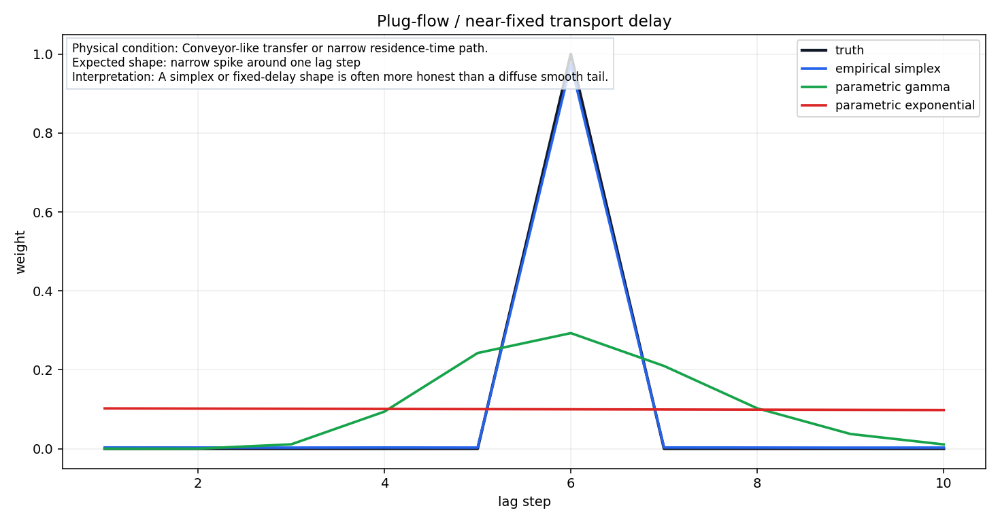
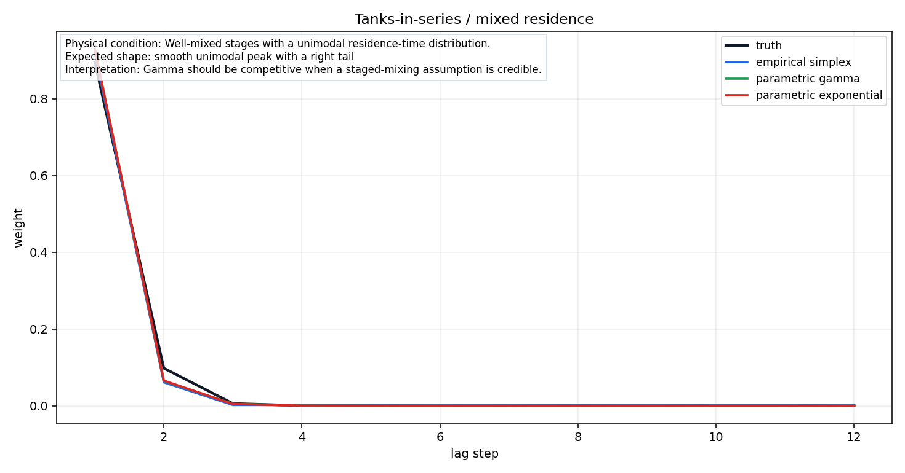
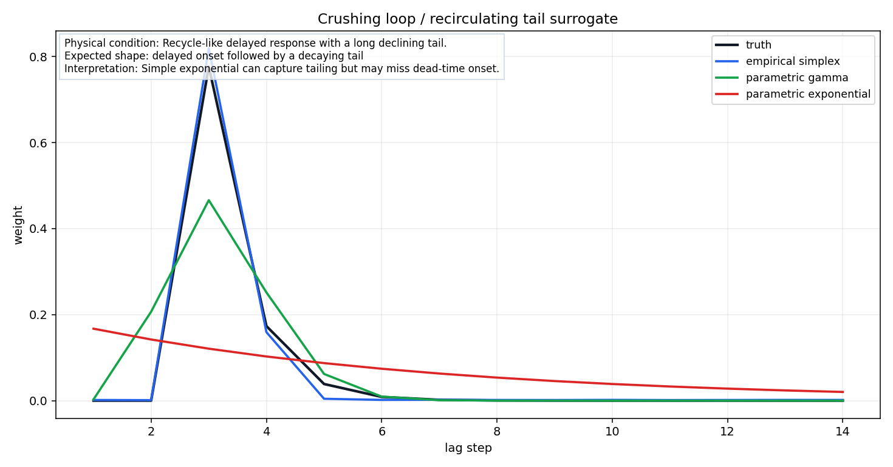
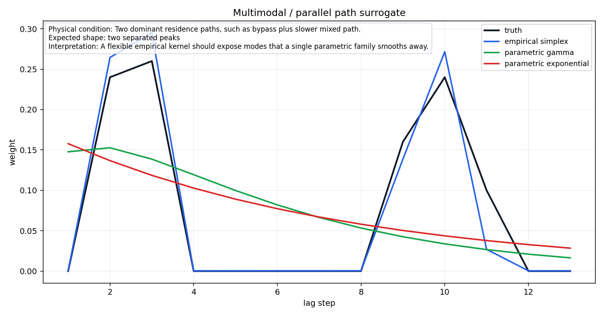
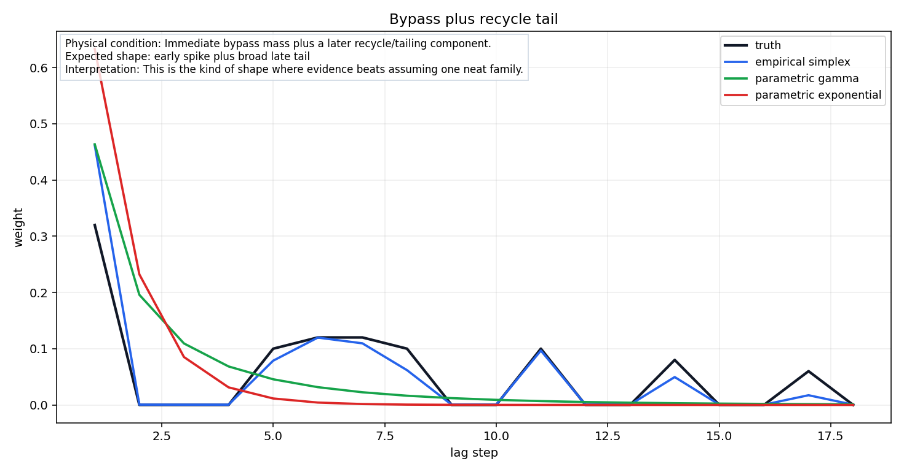
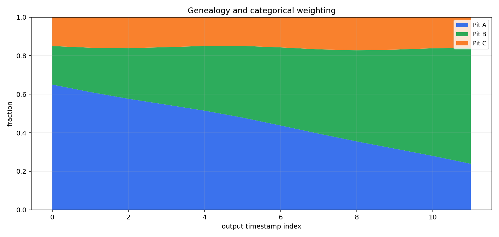

# Parametric vs Empirical Fit Gallery

This gallery replaces the old single crowded canvas with one static SVG per example.
Each fit example compares synthetic truth, empirical simplex, parametric gamma, and parametric exponential fits.
The genealogy example separately shows categorical/source weighting from kernel mass.

## Fit Examples

### Plug-flow / near-fixed transport delay

- Physical condition: Conveyor-like transfer or narrow residence-time path.
- Expected shape: narrow spike around one lag step
- Interpretation: A simplex or fixed-delay shape is often more honest than a diffuse smooth tail.

| kernel | family | validation loss | mean lag | p50 lag | p90 lag | warnings |
|---|---:|---:|---:|---:|---:|---:|
| truth | synthetic | n/a | 360.0 | 360.0 | 360.0 | none |
| empirical simplex | empirical | 0.0003915 | 359.0 | 360.0 | 360.0 | BEST_SINGLE_LAG_BEATS_LEARNED |
| parametric gamma | parametric | 0.1735 | 366.3 | 360.0 | 480.0 | BEST_SINGLE_LAG_BEATS_LEARNED |
| parametric exponential | parametric | 0.2831 | 327.7 | 300.0 | 540.0 | DIFFUSE_KERNEL, BEST_SINGLE_LAG_BEATS_LEARNED |

### Tanks-in-series / mixed residence

- Physical condition: Well-mixed stages with a unimodal residence-time distribution.
- Expected shape: smooth unimodal peak with a right tail
- Interpretation: Gamma should be competitive when a staged-mixing assumption is credible.

| kernel | family | validation loss | mean lag | p50 lag | p90 lag | warnings |
|---|---:|---:|---:|---:|---:|---:|
| truth | gamma | n/a | 66.7 | 60.0 | 120.0 | none |
| empirical simplex | empirical | 0.001287 | 71.0 | 60.0 | 60.0 | BOUNDARY_PILED_KERNEL, EXPONENTIAL_BASELINE_BEATS_LEARNED |
| parametric gamma | parametric | 0.001104 | 64.6 | 60.0 | 60.0 | BOUNDARY_PILED_KERNEL |
| parametric exponential | parametric | 0.001092 | 64.6 | 60.0 | 60.0 | BOUNDARY_PILED_KERNEL |

### Crushing loop / recirculating tail surrogate

- Physical condition: Recycle-like delayed response with a long declining tail.
- Expected shape: delayed onset followed by a decaying tail
- Interpretation: Simple exponential can capture tailing but may miss dead-time onset.

| kernel | family | validation loss | mean lag | p50 lag | p90 lag | warnings |
|---|---:|---:|---:|---:|---:|---:|
| truth | delayed_exponential | n/a | 197.2 | 180.0 | 240.0 | none |
| empirical simplex | empirical | 0.001987 | 195.8 | 180.0 | 240.0 | none |
| parametric gamma | parametric | 0.06175 | 191.7 | 180.0 | 240.0 | BEST_SINGLE_LAG_BEATS_LEARNED |
| parametric exponential | parametric | 0.2136 | 303.7 | 240.0 | 660.0 | DIFFUSE_KERNEL, BEST_SINGLE_LAG_BEATS_LEARNED |

### Multimodal / parallel path surrogate

- Physical condition: Two dominant residence paths, such as bypass plus slower mixed path.
- Expected shape: two separated peaks
- Interpretation: A flexible empirical kernel should expose modes that a single parametric family smooths away.

| kernel | family | validation loss | mean lag | p50 lag | p90 lag | warnings |
|---|---:|---:|---:|---:|---:|---:|
| truth | synthetic | n/a | 372.0 | 180.0 | 600.0 | none |
| empirical simplex | empirical | 0.04173 | 341.8 | 180.0 | 600.0 | none |
| parametric gamma | parametric | 0.1468 | 282.3 | 240.0 | 540.0 | DIFFUSE_KERNEL |
| parametric exponential | parametric | 0.1495 | 306.4 | 240.0 | 600.0 | DIFFUSE_KERNEL |

### Bypass plus recycle tail

- Physical condition: Immediate bypass mass plus a later recycle/tailing component.
- Expected shape: early spike plus broad late tail
- Interpretation: This is the kind of shape where evidence beats assuming one neat family.

| kernel | family | validation loss | mean lag | p50 lag | p90 lag | warnings |
|---|---:|---:|---:|---:|---:|---:|
| truth | synthetic | n/a | 385.2 | 360.0 | 840.0 | none |
| empirical simplex | empirical | 0.04447 | 296.0 | 300.0 | 660.0 | BOUNDARY_PILED_KERNEL |
| parametric gamma | parametric | 0.08636 | 162.0 | 120.0 | 360.0 | BOUNDARY_PILED_KERNEL |
| parametric exponential | parametric | 0.09495 | 94.7 | 60.0 | 180.0 | BOUNDARY_PILED_KERNEL |

## Genealogy and Categorical Weighting

This plot demonstrates how a kernel turns historical input slices into categorical source-fraction features.
For each output timestamp, earlier source labels inherit the lag weights, and labels are summed by category.

## Interpretation Boundary

- The empirical simplex fit is the flexible learned shape. It is useful when the physical family is uncertain.
- Parametric fits are lower-dimensional and easier to explain when the physical family is plausible.
- Multimodal fits are deliberately included because real process paths may contain bypasses, parallel paths, recycle, or mixed operating modes.
- Do not call a response kernel an RTD unless material movement, tracer, topology, or SME evidence supports that interpretation.
