# Plant-First Scenario Gallery

Generated from deterministic fixture sources using current public learners.

## Coverage Table

| kernel_family | scenario | validation_loss | recommendation_status |
|---|---|---:|---|
| `FixedDelayKernelLearner` | `conveyor` | 0.001604 | `recommended` |
| `ExponentialKernelLearner` | `cstr` | 0.003601 | `recommended` |
| `GammaKernelLearner` | `tanks_in_series` | 0.004862 | `recommended` |
| `ErlangKernelLearner` | `tanks_in_series` | 0.004201 | `recommended` |
| `LogNormalKernelLearner` | `flotation_banks` | 0.046718 | `recommended` |
| `DelayedExponentialKernelLearner` | `mini_flowsheet` | 0.153489 | `comparison` |
| `UniformKernelLearner` | `bounded_hold_up_tank` | 0.072574 | `recommended` |

## Conveyor

- Scenario key: `conveyor`
- Source: Deterministic synthetic fixture from scenario layer.
- Plant story: Near plug-flow conveyor with narrow transport delay.
- Fitted learners: `FixedDelayKernelLearner, SimplexKernelLearner, GammaKernelLearner, ExponentialKernelLearner`
- `recommended_kernel`: `FixedDelayKernelLearner`
- `recommendation_status`: `recommended`
- `recommendation_reason`: `lowest validation_loss among fitted learners for this scenario`
- `fit_quality_gate_passed`: `True`
- `fit_quality_gate_reason`: `selected positive kernel passes deterministic fit checks`
- `fit_quality_selected_kernel`: `FixedDelayKernelLearner`
- `fit_quality_selected_validation_loss`: `0.001604`
- `fit_quality_selected_no_lag`: `0.443977`
- `fit_quality_selected_best_single_lag`: `0.001604`
- `fit_quality_selected_warning_codes`: `none`
- `fit_quality_selected_mean_lag_seconds`: `360.00`
- `fit_quality_selected_p50_lag_seconds`: `360.00`
- `fit_quality_selected_p90_lag_seconds`: `360.00`

| learner | validation_loss | no_lag | best_single_lag | warning_codes | recommendation_status | recommendation_reason |
|---|---:|---:|---:|---|---|---|
| `FixedDelayKernelLearner` | 0.001604 | 0.443977 | 0.001604 | none | `reference_only` | comparison fit |
| `SimplexKernelLearner` | 0.001987 | 0.443977 | 0.001604 | BEST_SINGLE_LAG_BEATS_LEARNED | `reference_only` | comparison fit |
| `GammaKernelLearner` | 0.193189 | 0.443977 | 0.001604 | BEST_SINGLE_LAG_BEATS_LEARNED | `reference_only` | comparison fit |
| `ExponentialKernelLearner` | 0.233566 | 0.443977 | 0.001604 | BEST_SINGLE_LAG_BEATS_LEARNED | `reference_only` | comparison fit |

Feature preview:
```text
shape: (8, 8)
┌────────────┬────────────┬────────────┬───────────┬───────────┬───────────┬───────────┬───────────┐
│ time       ┆ recommende ┆ recommende ┆ recommend ┆ recommend ┆ recommend ┆ recommend ┆ recommend │
│ ---        ┆ d_num_inpu ┆ d_num_inpu ┆ ed_num_in ┆ ed_age_me ┆ ed_age_p5 ┆ ed_age_p9 ┆ ed_age_ta │
│ datetime[μ ┆ t_signal_w ┆ t_signal_w ┆ put_signa ┆ an        ┆ 0         ┆ 0         ┆ il_gt_thr │
│ s]         ┆ …          ┆ …          ┆ l_w…      ┆ ---       ┆ ---       ┆ ---       ┆ esh…      │
│            ┆ ---        ┆ ---        ┆ ---       ┆ f64       ┆ f64       ┆ f64       ┆ ---       │
│            ┆ f64        ┆ f64        ┆ f64       ┆           ┆           ┆           ┆ f64       │
╞════════════╪════════════╪════════════╪═══════════╪═══════════╪═══════════╪═══════════╪═══════════╡
│ T0 ┆ -1.315997  ┆ 0.0        ┆ -1.315997 ┆ 360.0     ┆ 360.0     ┆ 360.0     ┆ 0.0       │
│ 06:52:00   ┆            ┆            ┆           ┆           ┆           ┆           ┆           │
│ T0 ┆ 0.233998   ┆ 0.0        ┆ 0.233998  ┆ 360.0     ┆ 360.0     ┆ 360.0     ┆ 0.0       │
│ 06:53:00   ┆            ┆            ┆           ┆           ┆           ┆           ┆           │
│ T0 ┆ 0.088348   ┆ 0.0        ┆ 0.088348  ┆ 360.0     ┆ 360.0     ┆ 360.0     ┆ 0.0       │
│ 06:54:00   ┆            ┆            ┆           ┆           ┆           ┆           ┆           │
│ T0 ┆ -0.94253   ┆ 0.0        ┆ -0.94253  ┆ 360.0     ┆ 360.0     ┆ 360.0     ┆ 0.0       │
│ 06:55:00   ┆            ┆            ┆           ┆           ┆           ┆           ┆           │
│ T0 ┆ -0.878351  ┆ 0.0        ┆ -0.878351 ┆ 360.0     ┆ 360.0     ┆ 360.0     ┆ 0.0       │
│ 06:56:00   ┆            ┆            ┆           ┆           ┆           ┆           ┆           │
│ T0 ┆ -0.23666   ┆ 0.0        ┆ -0.23666  ┆ 360.0     ┆ 360.0     ┆ 360.0     ┆ 0.0       │
│ 06:57:00   ┆            ┆            ┆           ┆           ┆           ┆           ┆           │
│ T0 ┆ 1.148622   ┆ 0.0        ┆ 1.148622  ┆ 360.0     ┆ 360.0     ┆ 360.0     ┆ 0.0       │
│ 06:58:00   ┆            ┆            ┆           ┆           ┆           ┆           ┆           │
│ T0 ┆ -0.256334  ┆ 0.0        ┆ -0.256334 ┆ 360.0     ┆ 360.0     ┆ 360.0     ┆ 0.0       │
│ 06:59:00   ┆            ┆            ┆           ┆           ┆           ┆           ┆           │
└────────────┴────────────┴────────────┴───────────┴───────────┴───────────┴───────────┴───────────┘
```

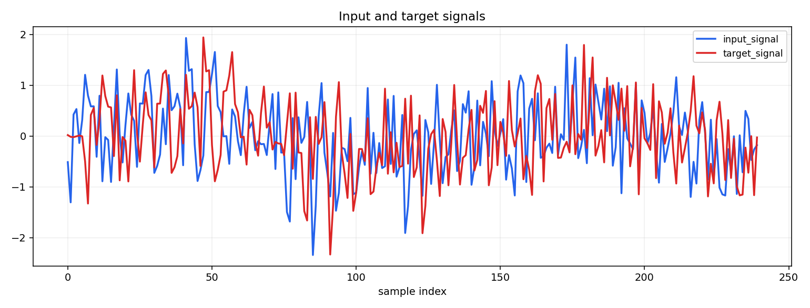
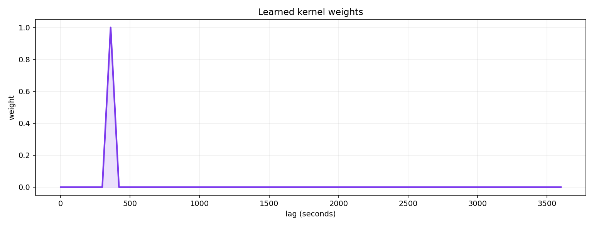
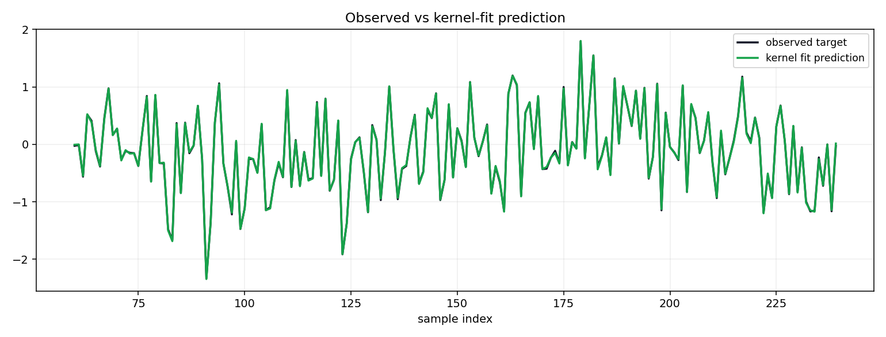

## Cstr

- Scenario key: `cstr`
- Source: Deterministic synthetic fixture from scenario layer.
- Plant story: Single well-mixed vessel with first-order tailing.
- Fitted learners: `ExponentialKernelLearner, SimplexKernelLearner, GammaKernelLearner`
- `recommended_kernel`: `SimplexKernelLearner`
- `recommendation_status`: `recommended`
- `recommendation_reason`: `lowest validation_loss among fitted learners for this scenario`
- `fit_quality_gate_passed`: `True`
- `fit_quality_gate_reason`: `selected positive kernel passes deterministic fit checks`
- `fit_quality_selected_kernel`: `ExponentialKernelLearner`
- `fit_quality_selected_validation_loss`: `0.003601`
- `fit_quality_selected_no_lag`: `0.010829`
- `fit_quality_selected_best_single_lag`: `0.010829`
- `fit_quality_selected_warning_codes`: `BOUNDARY_PILED_KERNEL`
- `fit_quality_selected_mean_lag_seconds`: `9.21`
- `fit_quality_selected_p50_lag_seconds`: `0.00`
- `fit_quality_selected_p90_lag_seconds`: `60.00`

| learner | validation_loss | no_lag | best_single_lag | warning_codes | recommendation_status | recommendation_reason |
|---|---:|---:|---:|---|---|---|
| `ExponentialKernelLearner` | 0.003601 | 0.010829 | 0.010829 | BOUNDARY_PILED_KERNEL | `reference_only` | comparison fit |
| `SimplexKernelLearner` | 0.003580 | 0.010829 | 0.010829 | BOUNDARY_PILED_KERNEL | `reference_only` | comparison fit |
| `GammaKernelLearner` | 0.165821 | 0.010829 | 0.010829 | WEAK_NO_LAG_IMPROVEMENT,BEST_SINGLE_LAG_BEATS_LEARNED,EXPONENTIAL_BASELINE_BEATS_LEARNED | `reference_only` | comparison fit |

Feature preview:
```text
shape: (8, 8)
┌────────────┬────────────┬────────────┬───────────┬───────────┬───────────┬───────────┬───────────┐
│ time       ┆ recommende ┆ recommende ┆ recommend ┆ recommend ┆ recommend ┆ recommend ┆ recommend │
│ ---        ┆ d_num_inpu ┆ d_num_inpu ┆ ed_num_in ┆ ed_age_me ┆ ed_age_p5 ┆ ed_age_p9 ┆ ed_age_ta │
│ datetime[μ ┆ t_signal_w ┆ t_signal_w ┆ put_signa ┆ an        ┆ 0         ┆ 0         ┆ il_gt_thr │
│ s]         ┆ …          ┆ …          ┆ l_w…      ┆ ---       ┆ ---       ┆ ---       ┆ esh…      │
│            ┆ ---        ┆ ---        ┆ ---       ┆ f64       ┆ f64       ┆ f64       ┆ ---       │
│            ┆ f64        ┆ f64        ┆ f64       ┆           ┆           ┆           ┆ f64       │
╞════════════╪════════════╪════════════╪═══════════╪═══════════╪═══════════╪═══════════╪═══════════╡
│ T0 ┆ 0.125092   ┆ 0.092424   ┆ 0.125092  ┆ 21.288472 ┆ 0.0       ┆ 60.0      ┆ 0.001641  │
│ 07:52:00   ┆            ┆            ┆           ┆           ┆           ┆           ┆           │
│ T0 ┆ -0.87339   ┆ 0.409114   ┆ -0.87339  ┆ 21.288472 ┆ 0.0       ┆ 60.0      ┆ 0.001641  │
│ 07:53:00   ┆            ┆            ┆           ┆           ┆           ┆           ┆           │
│ T0 ┆ 0.905763   ┆ 0.768986   ┆ 0.905763  ┆ 21.288472 ┆ 0.0       ┆ 60.0      ┆ 0.001641  │
│ 07:54:00   ┆            ┆            ┆           ┆           ┆           ┆           ┆           │
│ T0 ┆ -0.405754  ┆ 0.632502   ┆ -0.405754 ┆ 21.288472 ┆ 0.0       ┆ 60.0      ┆ 0.001641  │
│ 07:55:00   ┆            ┆            ┆           ┆           ┆           ┆           ┆           │
│ T0 ┆ -0.786899  ┆ 0.103344   ┆ -0.786899 ┆ 21.288472 ┆ 0.0       ┆ 60.0      ┆ 0.001641  │
│ 07:56:00   ┆            ┆            ┆           ┆           ┆           ┆           ┆           │
│ T0 ┆ -0.22414   ┆ 0.239612   ┆ -0.22414  ┆ 21.288472 ┆ 0.0       ┆ 60.0      ┆ 0.001641  │
│ 07:57:00   ┆            ┆            ┆           ┆           ┆           ┆           ┆           │
│ T0 ┆ -0.562018  ┆ 0.182036   ┆ -0.562018 ┆ 21.288472 ┆ 0.0       ┆ 60.0      ┆ 0.001641  │
│ 07:58:00   ┆            ┆            ┆           ┆           ┆           ┆           ┆           │
│ T0 ┆ 0.094158   ┆ 0.289944   ┆ 0.094158  ┆ 21.288472 ┆ 0.0       ┆ 60.0      ┆ 0.001641  │
│ 07:59:00   ┆            ┆            ┆           ┆           ┆           ┆           ┆           │
└────────────┴────────────┴────────────┴───────────┴───────────┴───────────┴───────────┴───────────┘
```

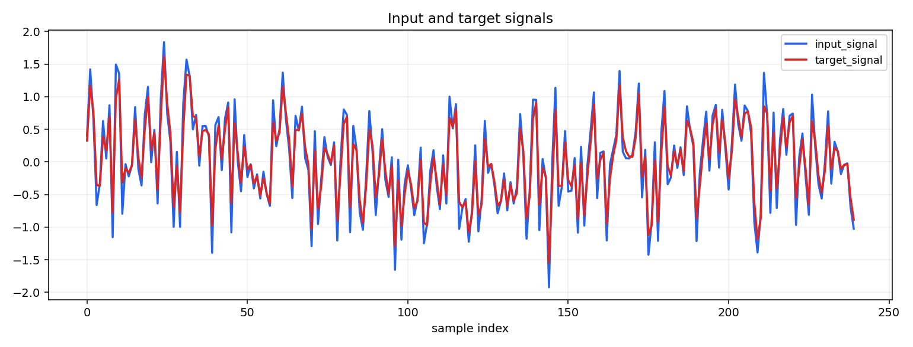
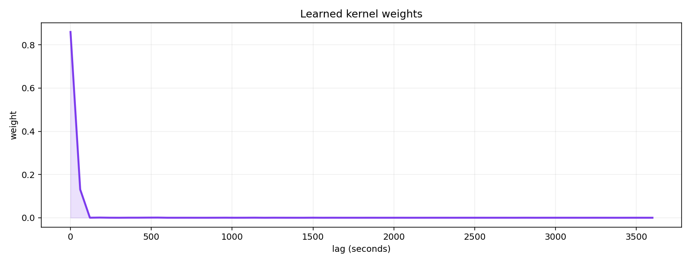
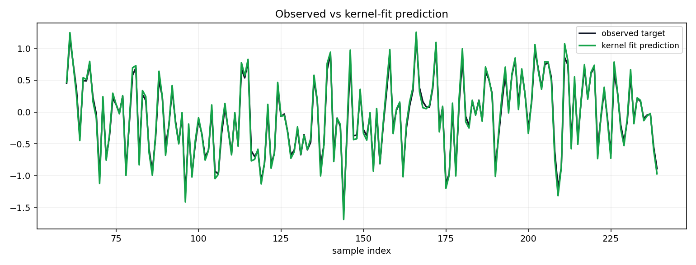

## Tanks In Series

- Scenario key: `tanks_in_series`
- Source: Deterministic synthetic fixture from scenario layer.
- Plant story: Staged mixing with unimodal spread.
- Fitted learners: `GammaKernelLearner, ErlangKernelLearner, SimplexKernelLearner, ExponentialKernelLearner`
- `recommended_kernel`: `ErlangKernelLearner`
- `recommendation_status`: `recommended`
- `recommendation_reason`: `lowest validation_loss among fitted learners for this scenario`
- `fit_quality_gate_passed`: `True`
- `fit_quality_gate_reason`: `selected positive kernel passes deterministic fit checks`
- `fit_quality_selected_kernel`: `ErlangKernelLearner`
- `fit_quality_selected_validation_loss`: `0.004201`
- `fit_quality_selected_no_lag`: `0.389358`
- `fit_quality_selected_best_single_lag`: `0.015707`
- `fit_quality_selected_warning_codes`: `none`
- `fit_quality_selected_mean_lag_seconds`: `69.97`
- `fit_quality_selected_p50_lag_seconds`: `60.00`
- `fit_quality_selected_p90_lag_seconds`: `120.00`

| learner | validation_loss | no_lag | best_single_lag | warning_codes | recommendation_status | recommendation_reason |
|---|---:|---:|---:|---|---|---|
| `GammaKernelLearner` | 0.004862 | 0.389358 | 0.015707 | none | `reference_only` | comparison fit |
| `ErlangKernelLearner` | 0.004201 | 0.389358 | 0.015707 | none | `reference_only` | comparison fit |
| `SimplexKernelLearner` | 0.004391 | 0.389358 | 0.015707 | none | `reference_only` | comparison fit |
| `ExponentialKernelLearner` | 0.141205 | 0.389358 | 0.015707 | BEST_SINGLE_LAG_BEATS_LEARNED | `reference_only` | comparison fit |

Feature preview:
```text
shape: (8, 8)
┌────────────┬────────────┬────────────┬───────────┬───────────┬───────────┬───────────┬───────────┐
│ time       ┆ recommende ┆ recommende ┆ recommend ┆ recommend ┆ recommend ┆ recommend ┆ recommend │
│ ---        ┆ d_num_inpu ┆ d_num_inpu ┆ ed_num_in ┆ ed_age_me ┆ ed_age_p5 ┆ ed_age_p9 ┆ ed_age_ta │
│ datetime[μ ┆ t_signal_w ┆ t_signal_w ┆ put_signa ┆ an        ┆ 0         ┆ 0         ┆ il_gt_thr │
│ s]         ┆ …          ┆ …          ┆ l_w…      ┆ ---       ┆ ---       ┆ ---       ┆ esh…      │
│            ┆ ---        ┆ ---        ┆ ---       ┆ f64       ┆ f64       ┆ f64       ┆ ---       │
│            ┆ f64        ┆ f64        ┆ f64       ┆           ┆           ┆           ┆ f64       │
╞════════════╪════════════╪════════════╪═══════════╪═══════════╪═══════════╪═══════════╪═══════════╡
│ T0 ┆ 0.096232   ┆ 0.333924   ┆ 0.096232  ┆ 69.969113 ┆ 60.0      ┆ 120.0     ┆ 2.2394e-9 │
│ 08:32:00   ┆            ┆            ┆           ┆           ┆           ┆           ┆ 1         │
│ T0 ┆ 0.445904   ┆ 0.207544   ┆ 0.445904  ┆ 69.969113 ┆ 60.0      ┆ 120.0     ┆ 2.2394e-9 │
│ 08:33:00   ┆            ┆            ┆           ┆           ┆           ┆           ┆ 1         │
│ T0 ┆ -0.720073  ┆ 0.536165   ┆ -0.720073 ┆ 69.969113 ┆ 60.0      ┆ 120.0     ┆ 2.2394e-9 │
│ 08:34:00   ┆            ┆            ┆           ┆           ┆           ┆           ┆ 1         │
│ T0 ┆ 0.298995   ┆ 0.531038   ┆ 0.298995  ┆ 69.969113 ┆ 60.0      ┆ 120.0     ┆ 2.2394e-9 │
│ 08:35:00   ┆            ┆            ┆           ┆           ┆           ┆           ┆ 1         │
│ T0 ┆ 0.113368   ┆ 0.192217   ┆ 0.113368  ┆ 69.969113 ┆ 60.0      ┆ 120.0     ┆ 2.2394e-9 │
│ 08:36:00   ┆            ┆            ┆           ┆           ┆           ┆           ┆ 1         │
│ T0 ┆ -0.324315  ┆ 0.174418   ┆ -0.324315 ┆ 69.969113 ┆ 60.0      ┆ 120.0     ┆ 2.2394e-9 │
│ 08:37:00   ┆            ┆            ┆           ┆           ┆           ┆           ┆ 1         │
│ T0 ┆ -0.927082  ┆ 0.241438   ┆ -0.927082 ┆ 69.969113 ┆ 60.0      ┆ 120.0     ┆ 2.2394e-9 │
│ 08:38:00   ┆            ┆            ┆           ┆           ┆           ┆           ┆ 1         │
│ T0 ┆ 0.266609   ┆ 0.555339   ┆ 0.266609  ┆ 69.969113 ┆ 60.0      ┆ 120.0     ┆ 2.2394e-9 │
│ 08:39:00   ┆            ┆            ┆           ┆           ┆           ┆           ┆ 1         │
└────────────┴────────────┴────────────┴───────────┴───────────┴───────────┴───────────┴───────────┘
```

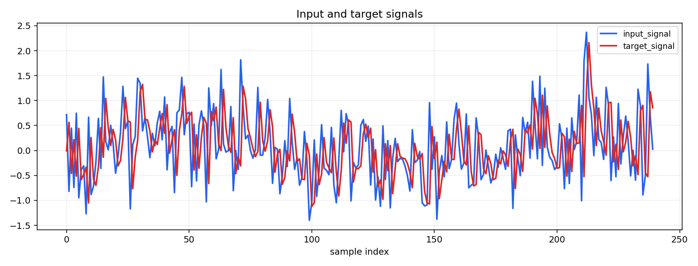
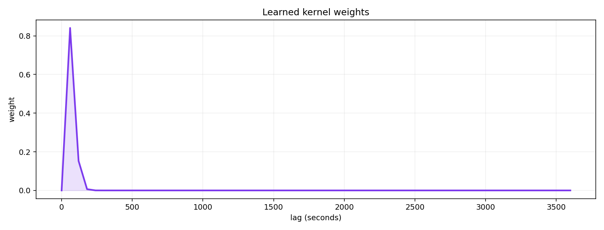
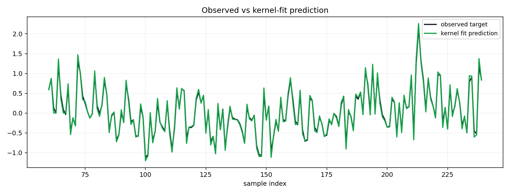

## Flotation Banks

- Scenario key: `flotation_banks`
- Source: Deterministic synthetic fixture from scenario layer.
- Plant story: Right-skewed spread from staged flotation residence-time effects.
- Fitted learners: `LogNormalKernelLearner, SimplexKernelLearner, GammaKernelLearner`
- `recommended_kernel`: `SimplexKernelLearner`
- `recommendation_status`: `recommended`
- `recommendation_reason`: `lowest validation_loss among fitted learners for this scenario`
- `fit_quality_gate_passed`: `True`
- `fit_quality_gate_reason`: `selected positive kernel passes deterministic fit checks`
- `fit_quality_selected_kernel`: `LogNormalKernelLearner`
- `fit_quality_selected_validation_loss`: `0.046718`
- `fit_quality_selected_no_lag`: `0.343265`
- `fit_quality_selected_best_single_lag`: `0.190029`
- `fit_quality_selected_warning_codes`: `none`
- `fit_quality_selected_mean_lag_seconds`: `255.71`
- `fit_quality_selected_p50_lag_seconds`: `240.00`
- `fit_quality_selected_p90_lag_seconds`: `360.00`

| learner | validation_loss | no_lag | best_single_lag | warning_codes | recommendation_status | recommendation_reason |
|---|---:|---:|---:|---|---|---|
| `LogNormalKernelLearner` | 0.046718 | 0.343265 | 0.190029 | none | `reference_only` | comparison fit |
| `SimplexKernelLearner` | 0.046417 | 0.343265 | 0.190029 | none | `reference_only` | comparison fit |
| `GammaKernelLearner` | 0.047491 | 0.343265 | 0.190029 | none | `reference_only` | comparison fit |

Feature preview:
```text
shape: (8, 8)
┌────────────┬────────────┬────────────┬───────────┬───────────┬───────────┬───────────┬───────────┐
│ time       ┆ recommende ┆ recommende ┆ recommend ┆ recommend ┆ recommend ┆ recommend ┆ recommend │
│ ---        ┆ d_num_inpu ┆ d_num_inpu ┆ ed_num_in ┆ ed_age_me ┆ ed_age_p5 ┆ ed_age_p9 ┆ ed_age_ta │
│ datetime[μ ┆ t_signal_w ┆ t_signal_w ┆ put_signa ┆ an        ┆ 0         ┆ 0         ┆ il_gt_thr │
│ s]         ┆ …          ┆ …          ┆ l_w…      ┆ ---       ┆ ---       ┆ ---       ┆ esh…      │
│            ┆ ---        ┆ ---        ┆ ---       ┆ f64       ┆ f64       ┆ f64       ┆ ---       │
│            ┆ f64        ┆ f64        ┆ f64       ┆           ┆           ┆           ┆ f64       │
╞════════════╪════════════╪════════════╪═══════════╪═══════════╪═══════════╪═══════════╪═══════════╡
│ T0 ┆ -0.141562  ┆ 0.938923   ┆ -0.141562 ┆ 256.74862 ┆ 240.0     ┆ 360.0     ┆ 0.001053  │
│ 08:32:00   ┆            ┆            ┆           ┆ 4         ┆           ┆           ┆           │
│ T0 ┆ -0.048087  ┆ 0.697856   ┆ -0.048087 ┆ 256.74862 ┆ 240.0     ┆ 360.0     ┆ 0.001053  │
│ 08:33:00   ┆            ┆            ┆           ┆ 4         ┆           ┆           ┆           │
│ T0 ┆ 0.105745   ┆ 0.412567   ┆ 0.105745  ┆ 256.74862 ┆ 240.0     ┆ 360.0     ┆ 0.001053  │
│ 08:34:00   ┆            ┆            ┆           ┆ 4         ┆           ┆           ┆           │
│ T0 ┆ -0.052707  ┆ 0.465608   ┆ -0.052707 ┆ 256.74862 ┆ 240.0     ┆ 360.0     ┆ 0.001053  │
│ 08:35:00   ┆            ┆            ┆           ┆ 4         ┆           ┆           ┆           │
│ T0 ┆ -0.448897  ┆ 0.657859   ┆ -0.448897 ┆ 256.74862 ┆ 240.0     ┆ 360.0     ┆ 0.001053  │
│ 08:36:00   ┆            ┆            ┆           ┆ 4         ┆           ┆           ┆           │
│ T0 ┆ -0.642011  ┆ 0.573813   ┆ -0.642011 ┆ 256.74862 ┆ 240.0     ┆ 360.0     ┆ 0.001053  │
│ 08:37:00   ┆            ┆            ┆           ┆ 4         ┆           ┆           ┆           │
│ T0 ┆ -0.713901  ┆ 0.485211   ┆ -0.713901 ┆ 256.74862 ┆ 240.0     ┆ 360.0     ┆ 0.001053  │
│ 08:38:00   ┆            ┆            ┆           ┆ 4         ┆           ┆           ┆           │
│ T0 ┆ -0.862378  ┆ 0.614435   ┆ -0.862378 ┆ 256.74862 ┆ 240.0     ┆ 360.0     ┆ 0.001053  │
│ 08:39:00   ┆            ┆            ┆           ┆ 4         ┆           ┆           ┆           │
└────────────┴────────────┴────────────┴───────────┴───────────┴───────────┴───────────┴───────────┘
```

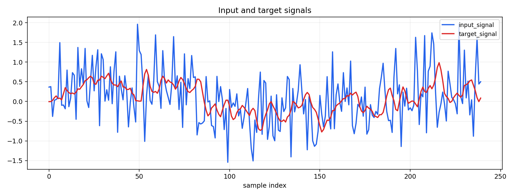
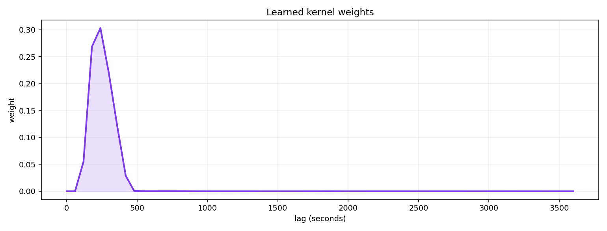
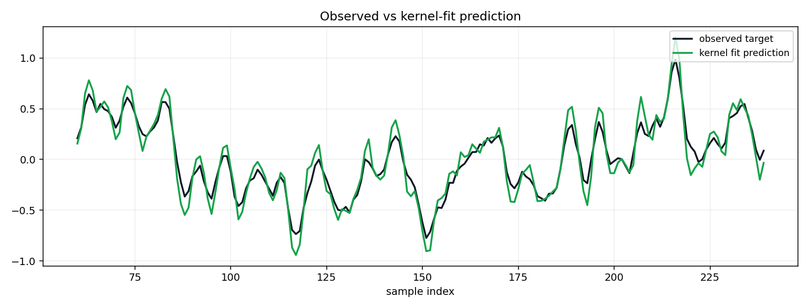

## Closed Loop Crushing

- Scenario key: `closed_loop_crushing`
- Source: Deterministic synthetic fixture from scenario layer.
- Plant story: Dead-time onset plus recycle/tailing.
- Fitted learners: `DelayedExponentialKernelLearner, SimplexKernelLearner, GammaKernelLearner, ExponentialKernelLearner`
- `recommended_kernel`: `SimplexKernelLearner`
- `recommendation_status`: `not_recommended`
- `recommendation_reason`: `fit quality gate failed: best_single_lag beats selected positive kernel; best_single_lag beats selected positive kernel by margin`
- `fit_quality_gate_passed`: `False`
- `fit_quality_gate_reason`: `best_single_lag beats selected positive kernel; best_single_lag beats selected positive kernel by margin`
- `fit_quality_selected_kernel`: `DelayedExponentialKernelLearner`
- `fit_quality_selected_validation_loss`: `0.353548`
- `fit_quality_selected_no_lag`: `0.494743`
- `fit_quality_selected_best_single_lag`: `0.023439`
- `fit_quality_selected_warning_codes`: `BEST_SINGLE_LAG_BEATS_LEARNED,UNIFORM_BASELINE_BEATS_LEARNED,EXPONENTIAL_BASELINE_BEATS_LEARNED`
- `fit_quality_selected_mean_lag_seconds`: `1920.39`
- `fit_quality_selected_p50_lag_seconds`: `1800.00`
- `fit_quality_selected_p90_lag_seconds`: `2460.00`

| learner | validation_loss | no_lag | best_single_lag | warning_codes | recommendation_status | recommendation_reason |
|---|---:|---:|---:|---|---|---|
| `DelayedExponentialKernelLearner` | 0.353548 | 0.494743 | 0.023439 | BEST_SINGLE_LAG_BEATS_LEARNED,UNIFORM_BASELINE_BEATS_LEARNED,EXPONENTIAL_BASELINE_BEATS_LEARNED | `reference_only` | comparison fit |
| `SimplexKernelLearner` | 0.007042 | 0.494743 | 0.023439 | none | `reference_only` | comparison fit |
| `GammaKernelLearner` | 0.113851 | 0.494743 | 0.023439 | BEST_SINGLE_LAG_BEATS_LEARNED | `reference_only` | comparison fit |
| `ExponentialKernelLearner` | 0.214163 | 0.494743 | 0.023439 | BEST_SINGLE_LAG_BEATS_LEARNED | `reference_only` | comparison fit |

Feature preview:
```text
shape: (8, 8)
┌────────────┬────────────┬────────────┬───────────┬───────────┬───────────┬───────────┬───────────┐
│ time       ┆ recommende ┆ recommende ┆ recommend ┆ recommend ┆ recommend ┆ recommend ┆ recommend │
│ ---        ┆ d_num_inpu ┆ d_num_inpu ┆ ed_num_in ┆ ed_age_me ┆ ed_age_p5 ┆ ed_age_p9 ┆ ed_age_ta │
│ datetime[μ ┆ t_signal_w ┆ t_signal_w ┆ put_signa ┆ an        ┆ 0         ┆ 0         ┆ il_gt_thr │
│ s]         ┆ …          ┆ …          ┆ l_w…      ┆ ---       ┆ ---       ┆ ---       ┆ esh…      │
│            ┆ ---        ┆ ---        ┆ ---       ┆ f64       ┆ f64       ┆ f64       ┆ ---       │
│            ┆ f64        ┆ f64        ┆ f64       ┆           ┆           ┆           ┆ f64       │
╞════════════╪════════════╪════════════╪═══════════╪═══════════╪═══════════╪═══════════╪═══════════╡
│ T0 ┆ -0.463307  ┆ 0.307822   ┆ -0.463307 ┆ 263.80314 ┆ 240.0     ┆ 300.0     ┆ 0.002142  │
│ 08:32:00   ┆            ┆            ┆           ┆ 2         ┆           ┆           ┆           │
│ T0 ┆ 0.8792     ┆ 0.558565   ┆ 0.8792    ┆ 263.80314 ┆ 240.0     ┆ 300.0     ┆ 0.002142  │
│ 08:33:00   ┆            ┆            ┆           ┆ 2         ┆           ┆           ┆           │
│ T0 ┆ 0.422191   ┆ 0.320028   ┆ 0.422191  ┆ 263.80314 ┆ 240.0     ┆ 300.0     ┆ 0.002142  │
│ 08:34:00   ┆            ┆            ┆           ┆ 2         ┆           ┆           ┆           │
│ T0 ┆ 0.013265   ┆ 0.156068   ┆ 0.013265  ┆ 263.80314 ┆ 240.0     ┆ 300.0     ┆ 0.002142  │
│ 08:35:00   ┆            ┆            ┆           ┆ 2         ┆           ┆           ┆           │
│ T0 ┆ 0.511294   ┆ 0.265062   ┆ 0.511294  ┆ 263.80314 ┆ 240.0     ┆ 300.0     ┆ 0.002142  │
│ 08:36:00   ┆            ┆            ┆           ┆ 2         ┆           ┆           ┆           │
│ T0 ┆ -0.021404  ┆ 0.286704   ┆ -0.021404 ┆ 263.80314 ┆ 240.0     ┆ 300.0     ┆ 0.002142  │
│ 08:37:00   ┆            ┆            ┆           ┆ 2         ┆           ┆           ┆           │
│ T0 ┆ -0.647492  ┆ 0.245748   ┆ -0.647492 ┆ 263.80314 ┆ 240.0     ┆ 300.0     ┆ 0.002142  │
│ 08:38:00   ┆            ┆            ┆           ┆ 2         ┆           ┆           ┆           │
│ T0 ┆ -0.034137  ┆ 0.320501   ┆ -0.034137 ┆ 263.80314 ┆ 240.0     ┆ 300.0     ┆ 0.002142  │
│ 08:39:00   ┆            ┆            ┆           ┆ 2         ┆           ┆           ┆           │
└────────────┴────────────┴────────────┴───────────┴───────────┴───────────┴───────────┴───────────┘
```

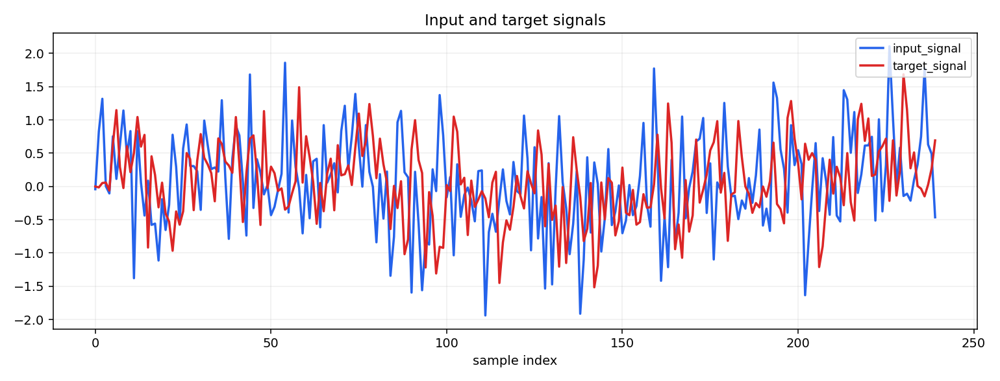
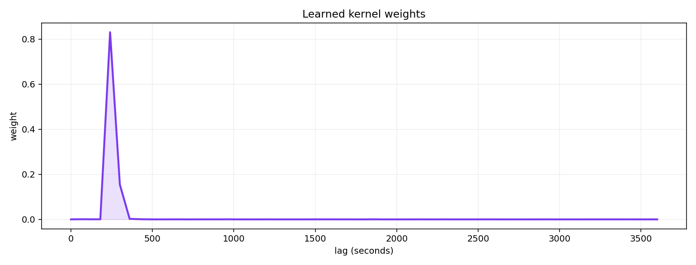
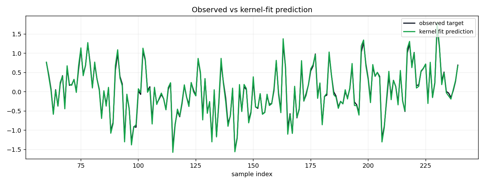

## Bounded Hold Up Tank

- Scenario key: `bounded_hold_up_tank`
- Source: Deterministic synthetic fixture from scenario layer.
- Plant story: Bounded blended hold-up window with finite support.
- Fitted learners: `UniformKernelLearner, SimplexKernelLearner, FixedDelayKernelLearner, ExponentialKernelLearner`
- `recommended_kernel`: `SimplexKernelLearner`
- `recommendation_status`: `recommended`
- `recommendation_reason`: `lowest validation_loss among fitted learners for this scenario`
- `fit_quality_gate_passed`: `True`
- `fit_quality_gate_reason`: `selected positive kernel passes deterministic fit checks`
- `fit_quality_selected_kernel`: `UniformKernelLearner`
- `fit_quality_selected_validation_loss`: `0.072574`
- `fit_quality_selected_no_lag`: `0.157401`
- `fit_quality_selected_best_single_lag`: `0.145443`
- `fit_quality_selected_warning_codes`: `DIFFUSE_KERNEL,EXPONENTIAL_BASELINE_BEATS_LEARNED`
- `fit_quality_selected_mean_lag_seconds`: `1800.00`
- `fit_quality_selected_p50_lag_seconds`: `1800.00`
- `fit_quality_selected_p90_lag_seconds`: `3240.00`

| learner | validation_loss | no_lag | best_single_lag | warning_codes | recommendation_status | recommendation_reason |
|---|---:|---:|---:|---|---|---|
| `UniformKernelLearner` | 0.072574 | 0.157401 | 0.145443 | DIFFUSE_KERNEL,EXPONENTIAL_BASELINE_BEATS_LEARNED | `reference_only` | comparison fit |
| `SimplexKernelLearner` | 0.012827 | 0.157401 | 0.145443 | none | `reference_only` | comparison fit |
| `FixedDelayKernelLearner` | 0.145443 | 0.157401 | 0.145443 | UNIFORM_BASELINE_BEATS_LEARNED,EXPONENTIAL_BASELINE_BEATS_LEARNED | `reference_only` | comparison fit |
| `ExponentialKernelLearner` | 0.022936 | 0.157401 | 0.145443 | none | `reference_only` | comparison fit |

Feature preview:
```text
shape: (8, 8)
┌────────────┬────────────┬────────────┬───────────┬───────────┬───────────┬───────────┬───────────┐
│ time       ┆ recommende ┆ recommende ┆ recommend ┆ recommend ┆ recommend ┆ recommend ┆ recommend │
│ ---        ┆ d_num_inpu ┆ d_num_inpu ┆ ed_num_in ┆ ed_age_me ┆ ed_age_p5 ┆ ed_age_p9 ┆ ed_age_ta │
│ datetime[μ ┆ t_signal_w ┆ t_signal_w ┆ put_signa ┆ an        ┆ 0         ┆ 0         ┆ il_gt_thr │
│ s]         ┆ …          ┆ …          ┆ l_w…      ┆ ---       ┆ ---       ┆ ---       ┆ esh…      │
│            ┆ ---        ┆ ---        ┆ ---       ┆ f64       ┆ f64       ┆ f64       ┆ ---       │
│            ┆ f64        ┆ f64        ┆ f64       ┆           ┆           ┆           ┆ f64       │
╞════════════╪════════════╪════════════╪═══════════╪═══════════╪═══════════╪═══════════╪═══════════╡
│ T0 ┆ -0.28567   ┆ 0.428974   ┆ -0.28567  ┆ 313.25635 ┆ 300.0     ┆ 600.0     ┆ 0.001033  │
│ 08:32:00   ┆            ┆            ┆           ┆ 3         ┆           ┆           ┆           │
│ T0 ┆ -0.285588  ┆ 0.42662    ┆ -0.285588 ┆ 313.25635 ┆ 300.0     ┆ 600.0     ┆ 0.001033  │
│ 08:33:00   ┆            ┆            ┆           ┆ 3         ┆           ┆           ┆           │
│ T0 ┆ -0.300713  ┆ 0.42836    ┆ -0.300713 ┆ 313.25635 ┆ 300.0     ┆ 600.0     ┆ 0.001033  │
│ 08:34:00   ┆            ┆            ┆           ┆ 3         ┆           ┆           ┆           │
│ T0 ┆ -0.133529  ┆ 0.40954    ┆ -0.133529 ┆ 313.25635 ┆ 300.0     ┆ 600.0     ┆ 0.001033  │
│ 08:35:00   ┆            ┆            ┆           ┆ 3         ┆           ┆           ┆           │
│ T0 ┆ -0.161168  ┆ 0.405903   ┆ -0.161168 ┆ 313.25635 ┆ 300.0     ┆ 600.0     ┆ 0.001033  │
│ 08:36:00   ┆            ┆            ┆           ┆ 3         ┆           ┆           ┆           │
│ T0 ┆ -0.02676   ┆ 0.345572   ┆ -0.02676  ┆ 313.25635 ┆ 300.0     ┆ 600.0     ┆ 0.001033  │
│ 08:37:00   ┆            ┆            ┆           ┆ 3         ┆           ┆           ┆           │
│ T0 ┆ -0.003525  ┆ 0.350928   ┆ -0.003525 ┆ 313.25635 ┆ 300.0     ┆ 600.0     ┆ 0.001033  │
│ 08:38:00   ┆            ┆            ┆           ┆ 3         ┆           ┆           ┆           │
│ T0 ┆ -0.014921  ┆ 0.349129   ┆ -0.014921 ┆ 313.25635 ┆ 300.0     ┆ 600.0     ┆ 0.001033  │
│ 08:39:00   ┆            ┆            ┆           ┆ 3         ┆           ┆           ┆           │
└────────────┴────────────┴────────────┴───────────┴───────────┴───────────┴───────────┴───────────┘
```

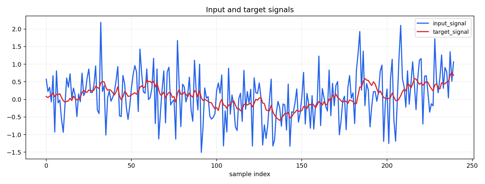
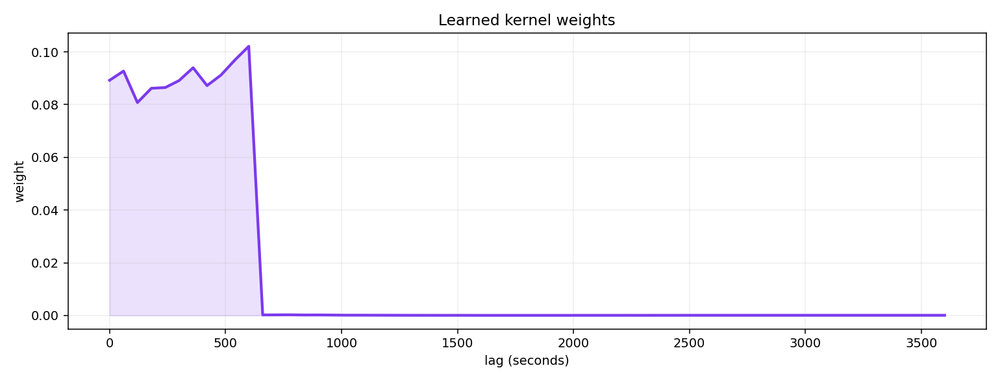
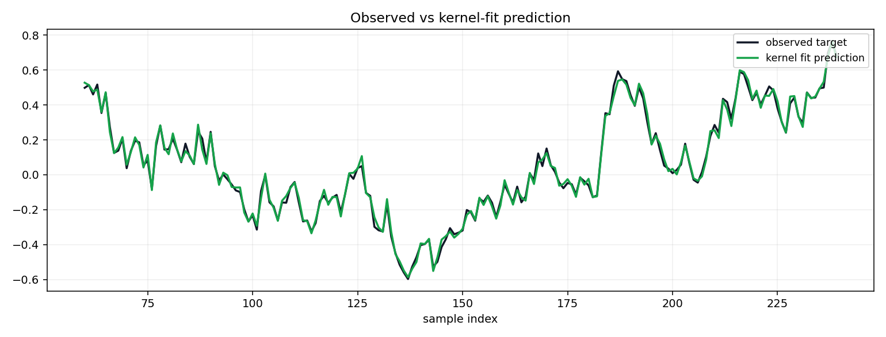

## Mini Flowsheet

- Scenario key: `mini_flowsheet`
- Source: Deterministic synthetic fixture from mini-flowsheet layer.
- Plant story: Composite synthetic plant story for feed to cleaner response.
- Fitted learners: `SimplexKernelLearner, GammaKernelLearner, LogNormalKernelLearner, DelayedExponentialKernelLearner, ExponentialKernelLearner`
- `recommended_kernel`: `GammaKernelLearner`
- `recommendation_status`: `not_recommended`
- `recommendation_reason`: `high-severity identifiability warning; best_single_lag baseline beats learned kernel; no_lag baseline beats learned kernel; best_single_lag baseline beats learned kernel by margin`
- `fit_quality_gate_passed`: `False`
- `fit_quality_gate_reason`: `high-severity identifiability warning; best_single_lag baseline beats learned kernel; no_lag baseline beats learned kernel; best_single_lag baseline beats learned kernel by margin`
- `fit_quality_selected_kernel`: `GammaKernelLearner`
- `fit_quality_selected_validation_loss`: `0.124663`
- `fit_quality_selected_no_lag`: `0.081553`
- `fit_quality_selected_best_single_lag`: `0.081553`
- `fit_quality_selected_warning_codes`: `WEAK_NO_LAG_IMPROVEMENT,LARGE_VALIDATION_GAP,DIFFUSE_KERNEL,BEST_SINGLE_LAG_BEATS_LEARNED,EXPONENTIAL_BASELINE_BEATS_LEARNED`
- `fit_quality_selected_mean_lag_seconds`: `1035.39`
- `fit_quality_selected_p50_lag_seconds`: `840.00`
- `fit_quality_selected_p90_lag_seconds`: `2160.00`
- API mapping: `input_col="feed_copper_grade"`, `target_col="cleaner_copper_grade"`, `category_cols=["ore_type"]`, `weight_col="feed_mass"`
- Ore campaign transition row: `324`


- Unit-level lag fits (best public learner per link):

| unit_link | learner | validation_loss | no_lag | best_single_lag | mean_lag_seconds | p50_lag_seconds | p90_lag_seconds | warning_codes | recommendation_status |
|---|---|---:|---:|---:|---:|---:|---:|---|---|
| `feed_mass -> crusher_output_mass` (Crushing) | `FixedDelayKernelLearner` | 0.012299 | 0.012299 | 0.012299 | 0.00 | 0.00 | 0.00 | WEAK_NO_LAG_IMPROVEMENT,BOUNDARY_PILED_KERNEL | `recommended` |
| `crusher_output_mass -> ball_mill_product_mass` (Ball mill) | `FixedDelayKernelLearner` | 0.004949 | 0.005603 | 0.004949 | 240.00 | 240.00 | 240.00 | none | `recommended` |
| `ball_mill_product_mass -> cyclone_overflow_mass` (Cyclone overflow) | `FixedDelayKernelLearner` | 0.004895 | 0.004895 | 0.004895 | 0.00 | 0.00 | 0.00 | WEAK_NO_LAG_IMPROVEMENT,BOUNDARY_PILED_KERNEL | `recommended` |
| `cyclone_overflow_mass -> flotation_bank_1_mass` (Flotation bank 1) | `FixedDelayKernelLearner` | 0.004302 | 0.004302 | 0.004302 | 0.00 | 0.00 | 0.00 | WEAK_NO_LAG_IMPROVEMENT,BOUNDARY_PILED_KERNEL | `recommended` |
| `flotation_bank_1_mass -> flotation_bank_2_mass` (Flotation bank 2) | `FixedDelayKernelLearner` | 0.003298 | 0.003298 | 0.003298 | 0.00 | 0.00 | 0.00 | WEAK_NO_LAG_IMPROVEMENT,BOUNDARY_PILED_KERNEL | `recommended` |
| `flotation_bank_2_mass -> flotation_bank_3_mass` (Flotation bank 3) | `FixedDelayKernelLearner` | 0.001931 | 0.001931 | 0.001931 | 0.00 | 0.00 | 0.00 | WEAK_NO_LAG_IMPROVEMENT,BOUNDARY_PILED_KERNEL | `recommended` |
| `flotation_bank_3_mass -> cleaner_product_mass` (Cleaner) | `FixedDelayKernelLearner` | 0.001531 | 0.001531 | 0.001531 | 0.00 | 0.00 | 0.00 | WEAK_NO_LAG_IMPROVEMENT,BOUNDARY_PILED_KERNEL | `recommended` |

- Future work boundary: regime-conditioned or ore-conditioned kernels may be useful later, but are out of scope for this documentation plan.

| learner | validation_loss | no_lag | best_single_lag | warning_codes | recommendation_status | recommendation_reason |
|---|---:|---:|---:|---|---|---|
| `SimplexKernelLearner` | 0.129320 | 0.081553 | 0.081553 | WEAK_NO_LAG_IMPROVEMENT,LARGE_VALIDATION_GAP,BEST_SINGLE_LAG_BEATS_LEARNED,EXPONENTIAL_BASELINE_BEATS_LEARNED | `not_recommended` | high-severity identifiability warning; best_single_lag baseline beats learned kernel; no_lag baseline beats learned kernel; best_single_lag baseline beats learned kernel by margin |
| `GammaKernelLearner` | 0.124663 | 0.081553 | 0.081553 | WEAK_NO_LAG_IMPROVEMENT,LARGE_VALIDATION_GAP,DIFFUSE_KERNEL,BEST_SINGLE_LAG_BEATS_LEARNED,EXPONENTIAL_BASELINE_BEATS_LEARNED | `not_recommended` | high-severity identifiability warning; best_single_lag baseline beats learned kernel; no_lag baseline beats learned kernel; best_single_lag baseline beats learned kernel by margin |
| `LogNormalKernelLearner` | 0.125031 | 0.081553 | 0.081553 | WEAK_NO_LAG_IMPROVEMENT,LARGE_VALIDATION_GAP,DIFFUSE_KERNEL,BEST_SINGLE_LAG_BEATS_LEARNED,EXPONENTIAL_BASELINE_BEATS_LEARNED | `not_recommended` | high-severity identifiability warning; best_single_lag baseline beats learned kernel; no_lag baseline beats learned kernel; best_single_lag baseline beats learned kernel by margin |
| `DelayedExponentialKernelLearner` | 0.153489 | 0.081553 | 0.081553 | WEAK_NO_LAG_IMPROVEMENT,LARGE_VALIDATION_GAP,BEST_SINGLE_LAG_BEATS_LEARNED,EXPONENTIAL_BASELINE_BEATS_LEARNED | `not_recommended` | high-severity identifiability warning; best_single_lag baseline beats learned kernel; no_lag baseline beats learned kernel; best_single_lag baseline beats learned kernel by margin |
| `ExponentialKernelLearner` | 0.133173 | 0.081553 | 0.081553 | WEAK_NO_LAG_IMPROVEMENT,LARGE_VALIDATION_GAP,DIFFUSE_KERNEL,BEST_SINGLE_LAG_BEATS_LEARNED,EXPONENTIAL_BASELINE_BEATS_LEARNED | `not_recommended` | high-severity identifiability warning; best_single_lag baseline beats learned kernel; no_lag baseline beats learned kernel; best_single_lag baseline beats learned kernel by margin |

Feature preview:
```text
shape: (10, 7)
┌──────────────┬─────────────┬─────────────┬─────────────┬─────────────┬─────────────┬─────────────┐
│ time         ┆ recommended ┆ recommended ┆ recommended ┆ recommended ┆ recommended ┆ recommended │
│ ---          ┆ _num_feed_c ┆ _num_feed_c ┆ _num_feed_c ┆ _cat_ore_ty ┆ _cat_ore_ty ┆ _cat_ore_ty │
│ datetime[μs] ┆ opper_gr…   ┆ opper_gr…   ┆ opper_gr…   ┆ pe_A_fra…   ┆ pe_B_fra…   ┆ pe_entro…   │
│              ┆ ---         ┆ ---         ┆ ---         ┆ ---         ┆ ---         ┆ ---         │
│              ┆ f64         ┆ f64         ┆ f64         ┆ f64         ┆ f64         ┆ f64         │
╞══════════════╪═════════════╪═════════════╪═════════════╪═════════════╪═════════════╪═════════════╡
│ T0   ┆ 1.074389    ┆ 0.009943    ┆ 1058.385647 ┆ 1.0         ┆ 0.0         ┆ -0.0        │
│ 11:50:00     ┆             ┆             ┆             ┆             ┆             ┆             │
│ T0   ┆ 1.075094    ┆ 0.009954    ┆ 1059.874928 ┆ 1.0         ┆ 0.0         ┆ -0.0        │
│ 11:51:00     ┆             ┆             ┆             ┆             ┆             ┆             │
│ T0   ┆ 1.075614    ┆ 0.0098      ┆ 1061.188078 ┆ 1.0         ┆ 0.0         ┆ -0.0        │
│ 11:52:00     ┆             ┆             ┆             ┆             ┆             ┆             │
│ T0   ┆ 1.075972    ┆ 0.009561    ┆ 1062.347246 ┆ 1.0         ┆ 0.0         ┆ -0.0        │
│ 11:53:00     ┆             ┆             ┆             ┆             ┆             ┆             │
│ T0   ┆ 1.076501    ┆ 0.009441    ┆ 1063.680805 ┆ 1.0         ┆ 0.0         ┆ -0.0        │
│ 11:54:00     ┆             ┆             ┆             ┆             ┆             ┆             │
│ T0   ┆ 1.076949    ┆ 0.009192    ┆ 1064.939319 ┆ 1.0         ┆ 0.0         ┆ -0.0        │
│ 11:55:00     ┆             ┆             ┆             ┆             ┆             ┆             │
│ T0   ┆ 1.077299    ┆ 0.00892     ┆ 1066.106829 ┆ 1.0         ┆ 0.0         ┆ -0.0        │
│ 11:56:00     ┆             ┆             ┆             ┆             ┆             ┆             │
│ T0   ┆ 1.077967    ┆ 0.009045    ┆ 1067.593724 ┆ 1.0         ┆ 0.0         ┆ -0.0        │
│ 11:57:00     ┆             ┆             ┆             ┆             ┆             ┆             │
│ T0   ┆ 1.078638    ┆ 0.009106    ┆ 1069.088004 ┆ 1.0         ┆ 0.0         ┆ -0.0        │
│ 11:58:00     ┆             ┆             ┆             ┆             ┆             ┆             │
│ T0   ┆ 1.079571    ┆ 0.009651    ┆ 1070.847451 ┆ 1.0         ┆ 0.0         ┆ -0.0        │
│ 11:59:00     ┆             ┆             ┆             ┆             ┆             ┆             │
└──────────────┴─────────────┴─────────────┴─────────────┴─────────────┴─────────────┴─────────────┘
```

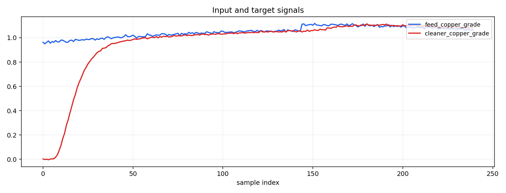
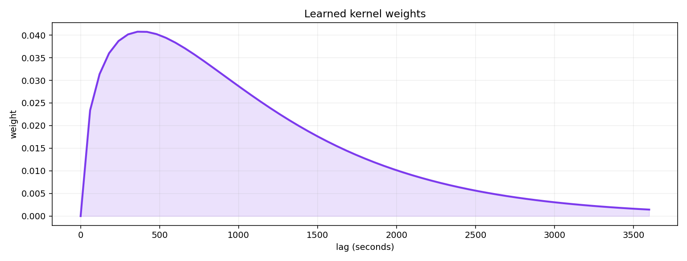
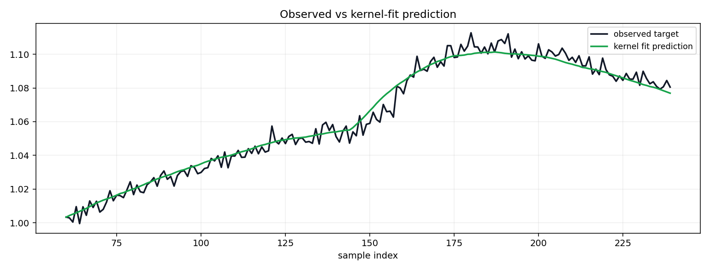
