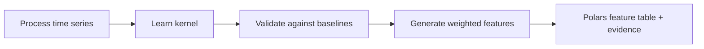

# rtdfeatures documentation

`rtdfeatures` learns constrained lag kernels from regular-grid process time series and turns them into auditable lag-aware features for downstream modelling.

## Getting started

- [Install](install.md) — pip install, Python version, dependencies
- [Quickstart](quickstart.md) — end-to-end example in 30 seconds

## Concepts

- [Kernels and RTDs](concepts/kernels-and-rtds.md) — what a kernel is, and when it may be interpreted as an RTD
- [Interpretation boundary](concepts/interpretation-boundary.md) — guidelines for labelling kernels responsibly
- [Identifiability](concepts/identifiability.md) — when a learned kernel is worth trusting
- [Data model](concepts/data-model.md) — regular grid, warmup, lag windows, missing data, categorical handling

## User guides

- [Fitting kernels](user-guide/fitting-kernels.md) — using SimplexKernelLearner and parametric learners
- [Comparing kernels](user-guide/comparing-kernels.md) — baseline comparison and candidate fitting
- [Generating features](user-guide/generating-features.md) — using KernelFeatureBuilder
- [Categorical genealogy](user-guide/categorical-genealogy.md) — categorical fraction features
- [Feature evidence](user-guide/feature-evidence.md) — diagnostics and provenance metadata
- [Out-of-fold generation](user-guide/out-of-fold.md) — leakage-safe feature generation
- [Performance](user-guide/performance.md) — runtime and memory notes
- [Personas and workflows](user-guide/personas-and-workflows.md) — who should use what
- [sklearn adapter](user-guide/sklearn-adapter.md) — using KernelFeatureTransformer in sklearn pipelines

## Examples

- [nRTD laminar flow](examples/nrtd_laminar_flow_worked_example.md) — flagship extracted benchmark worked example
- [Plant-first scenario gallery](examples/plant_first_gallery.md) — scenario-first synthetic gallery and kernel-family coverage
- [Parametric vs empirical gallery](examples/parametric_empirical_fit_gallery.md) — physical-shape comparisons and categorical weighting evidence

## API reference

- [Kernels](api/kernels.md) — Kernel, LearnedKernel, FixedDelayKernel, parametric kernel classes
- [Learners](api/learners.md) — SimplexKernelLearner, parametric learners, shared learners
- [Features](api/features.md) — KernelFeatureBuilder and transform methods
- [Evidence](api/evidence.md) — diagnostics, bootstrap, evidence objects
- [Stability](api/stability.md) — API stability policy and versioning
- [sklearn adapter](api/sklearn-adapter.md) — KernelFeatureTransformer API reference

## Development

- [Architecture](development/architecture.md) — module structure and design
- [Architecture principles](development/architecture-principles.md) — product-centred design guardrails
- [Release process](development/release-process.md) — how versions are cut
- [Local dev setup](development/local-dev.md) — how to set up a development environment
- [Testing guide](development/testing.md) — how to run and write tests
- [Deprecation policy](development/deprecation-policy.md) — API stability and versioning
- [Release notes](RELEASE_NOTES.md) — per-version changelog

## Support

- [Troubleshooting](user-guide/troubleshooting.md) — common errors and their fixes
- [Contributing](../CONTRIBUTING.md) — contributor guide and PR checklist

---

### Reference documents (normative, for maintainers)

The following design documents define the package contract and are internal references:

Internal changes should preserve the golden path: fit or define kernel → generate `TransformResult` → inspect features/report/registry. See `development/architecture-principles.md`.

- [Product charter](01_product_charter.md)
- [Core concepts](02_core_concepts.md)
- [Scope and non-goals](03_scope_and_non_goals.md)
- [Kernel learning design](04_kernel_learning_design.md)
- [Feature generation design](05_feature_generation_design.md)
- [Data model](06_data_model.md)
- [Validation and diagnostics](07_validation_and_diagnostics.md)
- [API design](08_api_design.md)
- [Package architecture](09_package_architecture.md)
- [Development roadmap](12_development_roadmap.md)
